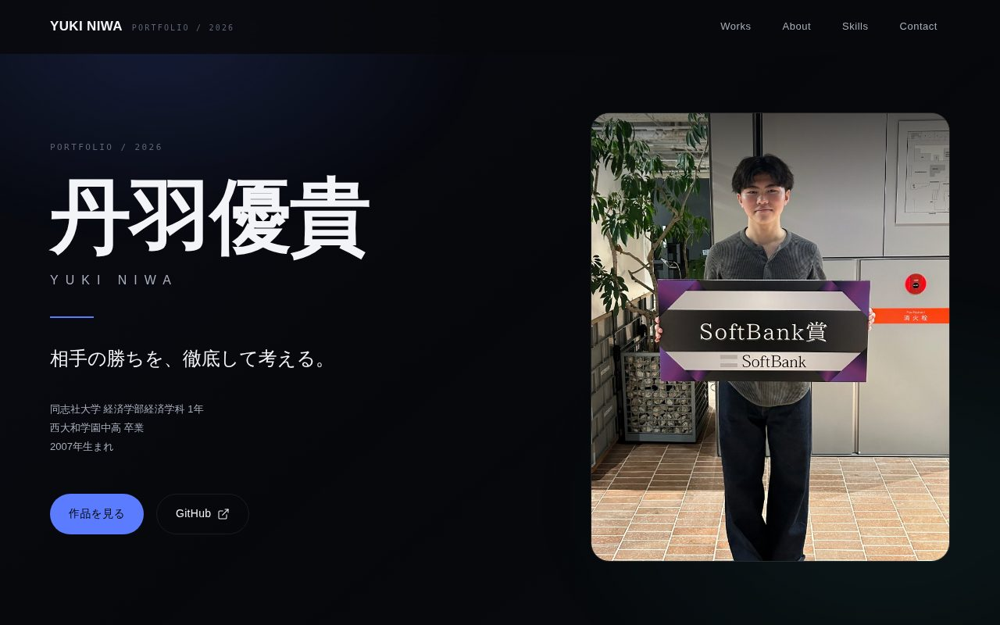
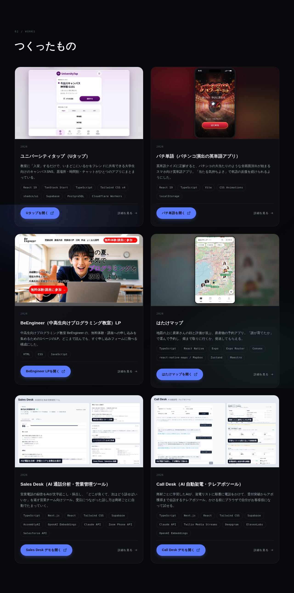

# 丹羽優貴のポートフォリオサイト

同志社大学経済学部の丹羽優貴（にわ ゆうき / YUKI NIWA）が、これまでに作ったアプリやサイトをまとめたポートフォリオです。

**サイト：https://niwayukun-1234.github.io/**



## 掲載している作品

それぞれの作品ページで、何を解決したくて作ったか、できること、実際の画面、使った技術をまとめています。ほとんどの作品は、ゲストとして実際に触れます。

| 作品 | ひとことで言うと | ソースコード |
|---|---|---|
| [ユニバーシティタップ（Uタップ）](https://niwayukun-1234.github.io/works/univtap/) | 教室に「入室」して、いまの居場所をフレンドに共有する大学生向けSNS | [universitytap](https://github.com/niwayukun-1234/universitytap) |
| [パチ単語](https://niwayukun-1234.github.io/works/pachitango/) | 正解するとパチンコの演出が始まる英単語アプリ | [Pachinko_learning](https://github.com/niwayukun-1234/https-cloud0327.github.io-Pachinko_learning-) |
| [BeEngineer LP](https://niwayukun-1234.github.io/works/niwa-lp/) | 中高生向けプログラミング教室の申し込みページ | [niwaLP](https://github.com/niwayukun-1234/niwaLP) |
| [はたけマップ](https://niwayukun-1234.github.io/works/hatake-map/) | 地図の上に農家さんの顔が並ぶ、農産物の予約アプリ | [hatake-map](https://github.com/niwayukun-1234/hatake-map) |
| [Sales Desk](https://niwayukun-1234.github.io/works/sales-ai/) | 営業電話をAIが採点し、受注につながる話し方をためる営業ツール | 非公開 |
| [Call Desk](https://niwayukun-1234.github.io/works/call-desk/) | AIが架電リストに電話をかけてアポを取るテレアポツール | 非公開 |



## このサイトでできること

- **作品一覧と作品ページ**：作品ごとに「解決したいこと → 作ったもの（できること）→ 実際の画面 → 使った技術 → 成果と工夫」の順で説明しています。
- **デモ**：Sales Desk と Call Desk のデモは、このサイトの中（`/sales-ai/` と `/call-desk/`）に置いてあり、ログインせずにゲストとして全画面を操作できます。
- **プロフィール**：経歴の時系列、よく使う技術とAIツール（Claude Code・Genspark・Codex）、連絡先。
- **オープニング演出**：最初に開いたときのアニメーションと効果音（ブラウザの音声合成で鳴らしています）。
- **閲覧ログ**：いつ・何人が来て・どこまで読んだかを記録し、本人だけが見られる管理ページ（`/admin/`）で確認できます。

## 使っている技術

- フレームワークを使わない素の HTML / CSS / JavaScript（ビルドに必要なのは Node.js 標準機能だけ）
- 作品データは `works.json` にまとめていて、`scripts/build-works.mjs` が作品ページと `sitemap.xml` を自動で生成
- 公開は GitHub Pages（`main` に入ると GitHub Actions が自動でデプロイ）
- 閲覧ログは Supabase に保存し、データベースの行レベルセキュリティで「書き込みは誰でも・読めるのは管理者だけ」にしています
- アクセス解析は Google Analytics 4 も併用

## 作品を追加・編集するには

1. `works.json` に作品を1件足す（または書き換える）。主な項目はこのとおりです。

   ```jsonc
   {
     "slug": "hatake-map",                 // URL になる名前（/works/hatake-map/）
     "title": "はたけマップ",
     "summary": "一覧に出るひとこと説明",
     "tech": ["TypeScript", "React Native"],
     "thumbnail": { "wide": "/images/work-hatake-map.jpg" },
     "links": [{ "label": "はたけマップ", "url": "https://…" }],
     "body": { "challenge": "…", "built": "…", "stack": "…", "result": "…" },
     "features": ["できること1", "できること2"],  // 作ったもの の下に箇条書きで出る
     "gallery": [                                    // 実際の画面（frame は phone か wide）
       { "src": "/images/works/hatake-map/01-map.jpg", "caption": "説明", "frame": "phone" }
     ]
   }
   ```

2. 画像を `images/`（一覧用のサムネ）と `images/works/<slug>/`（作品ページの画面）に置く。
3. `index.html` の中にある `works-fallback-data`（`works.json` を読めない環境用の控え）も同じ内容にそろえる。
4. 下のコマンドで作品ページを作り直す。

## ローカルで確認する

```bash
npm run serve        # http://localhost:4173 で確認
npm run build        # works.json から works/<slug>/ と sitemap.xml を作り直す
npm run build:dist   # 公開用の一式を dist/ に出力（GitHub Actions が使う）
```

依存パッケージはないので `npm install` は不要です。

## フォルダ構成

```
index.html                 トップ（Hero / Works / About / Skills / Contact）
works.json                 作品データ
works/<slug>/index.html    作品ページ（build-works.mjs が生成）
scripts/                   作品ページを作るスクリプトとテンプレート
css/  js/                  見た目と動き（色や余白は css/tokens.css にまとめている）
images/                    サムネ・作品の画面・プロフィール写真
sales-ai/  call-desk/      Sales Desk と Call Desk のデモ（ビルド済み）
admin/                     閲覧ログの管理ページ（管理者だけが見られる）
docs/screenshots/          この README の画像
```

デザインの考え方（動きは `transform` と `opacity` だけ、アクセントカラーは1色、動きを減らす設定やJS無効でも崩れない、など）と受け入れ基準の確認記録は [`_notes/build-conformance.md`](_notes/build-conformance.md) にあります。

## 連絡先

- サイト：https://niwayukun-1234.github.io/
- メール：yuki.niwa0626@gmail.com
